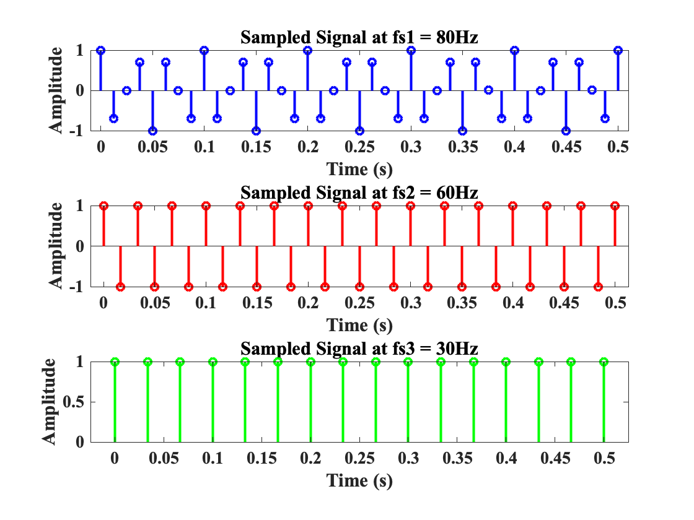

## Mini Project 6 
### Graph 1

### Graph 2

### Orginal Audio File

<audio controls>
  <source src="assets/audio/AuntRhody.wav" type="audio/wav">
  Your browser does not support the audio element.
</audio>